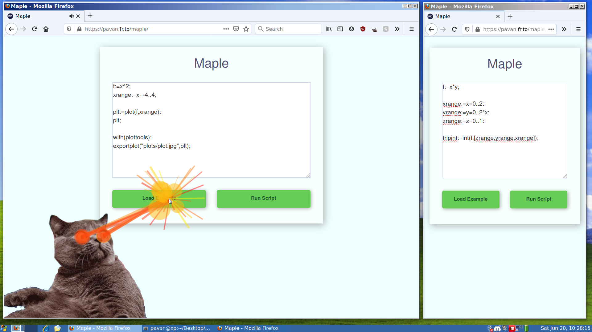
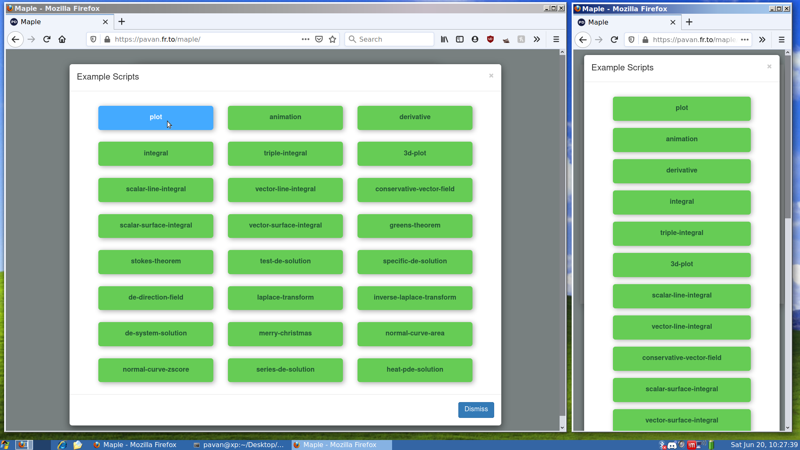
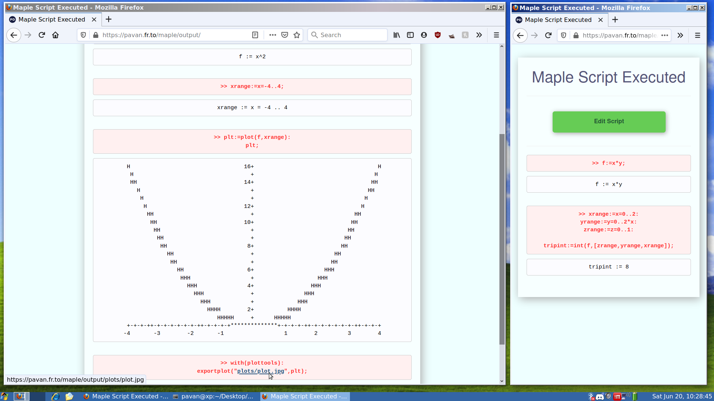

# Maple
A Mobile Web Interface to Maplesoft Maple

## About
* PHP interfaces between the script entered and `cmaple`, a command line
interface for Maple.
* Additionally the script and its output are parsed and merged together to
show the direct effects of each entered command.
* Example Maple scripts based on my undergrad are included to show some of
Maple's basic and sophisticated tools.
* [See it in action](https://pavan.fr.to/maple/)

## Notice
* The server hosting this website must have maple installed and the path to
`cmaple` may need to be changed depending on your installation.
Also if the web server is running on Windows, the php code that executes the
shell command will need to be modified for Windows.
* In order for exporting plots to work, make a folder called 'plots' and make
sure that the webserver has permission to write to that folder.

## Screenshots

